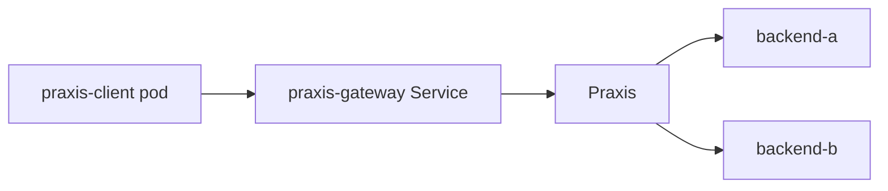

# Standalone praxis-gateway

This Forge topology proves that `charts/praxis-gateway` deploys a working
Praxis proxy on its own. It creates one Kind cluster with no AGN Operator, no
Grid CRDs, and no Grid values, then installs and reconfigures the chart and
sends real requests through the gateway after every change.



Both namespaces enforce the restricted Pod Security Standard, so the chart's
pods, including its `helm test` pod, must meet it with default values. The
backends are busybox `httpd` servers that answer with their own name.

## Stages

Forge applies the stacks in order. Each `helm` step upgrades the same release,
and `verify.sh` checks the result before the next stage starts.

| Stage | Chart values | Checks |
|-------|--------------|--------|
| `default` | none, after uninstalling any earlier release | `GET /` returns the built-in JSON status, other paths return 404, Praxis runs as UID 100 |
| `inline-v1` | `config.inline` routing to backend-a | `GET /` reaches backend-a with `X-Config-Version: v1` |
| `inline-v2` | changed `config.inline` | `GET /` moves to backend-b with `v2`, `/static` is answered by Praxis |
| `existing` | `config.existingConfigMap` with key `gateway.yaml` | `GET /` reaches backend-a with `existing`, the chart's ConfigMap is gone |
| `core-image` | core `ghcr.io/praxis-proxy/praxis` image with `command: [praxis]` | the core build serves its config |
| `release` | none | `helm test` passes, the release holds only a ConfigMap, Deployment, and Service, no Grid CRDs or other workloads exist, and the notes and description do not assume Grid |

Every traffic check waits for the rollout, then needs six matching responses
in a row so no pod still serves an older configuration. A request that gets no
HTTP response at all fails the stage, since the gateway dropped it.

## Running it

From the repository root:

```bash
make praxis-gateway-e2e
```

`scripts/e2e-praxis-gateway.sh` builds `praxis-forge` from this workspace,
runs `praxis-forge up` to create the cluster and `praxis-forge apply gateway`
to run the stages, prints every check, and tears the cluster down. It fails
unless the last stage reports a pass, so a stage that never ran cannot look
like success. Set
`KEEP=1` to keep the cluster (context `kind-praxis-standalone-gateway`) for
manual testing. On rootless podman, Kind needs a delegated cgroup:

```bash
KIND_CREATE_PREFIX="systemd-run --scope --user -p Delegate=yes" KEEP=1 make praxis-gateway-e2e
```

CI runs the same script in the `gateway-standalone` job of the Helm workflow
on pull requests, pushes to `main`, and the merge queue.
